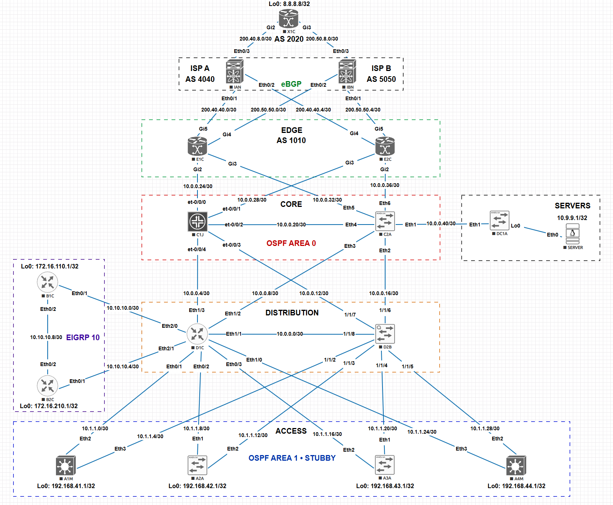

# ✨ netKB • Network Knowledge Base

[](https://github.com/pdudotdev/netKB/releases/tag/1.0.0)

[](https://github.com/pdudotdev/netKB/commits/main/)

| | |
|---|---|
| **Platforms** |         |
| **Transport** |   |
| **Integrations** |     |

## Table of Contents

- [Overview](#-overview)
- [What's New](#-whats-new-in-v10)
- [Tech Stack](#tech-stack)
- [Scope](#-scope)
- [Installation & Usage](#️-installation--usage)
- [Usage](#-usage)
- [Knowledge Base](#-knowledge-base)
- [Project Structure](#️-project-structure)
- [Test Network Topology](#-test-network-topology)
- [Planned Upgrades](#️-planned-upgrades)
- [Disclaimer](#-disclaimer)
- [License](#-license)
- [Collaborations](#-collaborations)

## 🔭 Overview

RAG-powered troubleshooting assistant for multi-vendor networks. 

Combines documentation retrieval (RFCs + vendor guides + network intent) with live device queries across 5+ vendors.

▫️ **Supported models:**
- [x] Haiku 4.5
- [x] Sonnet 4.6
- [x] Opus 4.6 (default, best reasoning)

▫️ **Operational Flow:**
- [x] See [**workflow.md**](metadata/workflow/workflow.md)

▫️ **Operational Guardrails:**
- [x] See [**guardrails.md**](metadata/guardrails/guardrails.md)

## ⭐ What's New in v1.0

- [x] See [**CHANGELOG.md**](CHANGELOG.md)

## Tech Stack

| Technology | Role |
|-----------|------|
| Python | Core language |
| FastMCP | MCP server exposing 3 tools |
| Claude | Reasoning, context, troubleshooting |
| LangChain | RAG pipeline (chunking, embedding, retrieval) |
| ChromaDB | Vector database for knowledge base |
| HuggingFace Embeddings | Local embedding model (all-MiniLM-L6-v2) |
| NetBox | Device inventory (hostnames, IPs, platforms) |
| HashiCorp Vault | Credential management |
| Scrapli | Multi-vendor SSH transport |

## 📋 Scope

| Protocol | What's Checked |
|----------|---------------|
| **OSPF** | Neighbor states, area config, process config, LSDB |
| **Interfaces** | Up/down state, expected operational status |

## 🛠️ Installation & Usage

▫️ **Prerequisites:**
- Python 3.11+
- HashiCorp Vault
- NetBox

▫️ **Step 1 - Install:**
```bash
# Create virtualenv and install dependencies
git clone https://github.com/pdudotdev/netKB
python3 -m venv netkb
netkb/bin/pip install -r requirements.txt
```

▫️ **Step 2 - Vault:**

Start Vault (dev mode, lab use):
```
vault server -dev -dev-root-token-id=<your-root-token>
export VAULT_ADDR=http://127.0.0.1:8200
export VAULT_TOKEN=<your-root-token>
```

Or initialize and unseal an existing Vault:
```
vault operator init -key-shares=1 -key-threshold=1   # first-time setup
vault operator unseal                                  # after every restart
```

> 🔑 Save the unseal key output from `vault operator init` somewhere safe - you'll need it every time Vault restarts or seals. Without it, a sealed Vault cannot be recovered.

> ⚠️ netKB requires Vault to be **running and unsealed** before any run. If Vault is unavailable, credential lookups fall back to env vars (see `.env.example`).

Store secrets:
```
vault kv put secret/netkb/router username=<user> password=<pass>
vault kv put secret/netkb/netbox token=<token>
```

▫️ **Step 3 - Configure `.env`:**
- [x] See [**example**](.env.example)
```
cp .env.example .env
```

▫️ **Step 4 - Claude auth**:

**Option A** - Anthropic account:
```
claude auth login
```
**Option B** - API key via Vault.

▫️ **Step 5 - Register the MCP server:**
```
claude mcp add netkb -s user -- /path/to/netkb/bin/python /path/to/netKB/server/MCPServer.py
```

▫️ **Step 6 - Ingest docs into ChromaDB:**
```
netkb/bin/python ingest.py
```

## 🦾 Usage

```
cd /path/to/netKB
claude

> What causes OSPF neighbors to get stuck in EXSTART state?
> D1C's OSPF neighbor with A2A is in INIT — what's wrong?
> How does MikroTik handle OSPF configuration differently from Cisco?
> Which devices are ABRs in this network? What about ASBRs?
```

## 📚 Knowledge Base

- See [**docs/**](docs/):

⚠️ To update the knowledge base after editing docs:
```bash
netkb/bin/python ingest.py --clean
```

## 🏗️ Project Structure

```
netKB/
├── server/
│   └── MCPServer.py              # FastMCP server (3 tools)
├── tools/                        # MCP tool implementations
│   ├── ospf.py                   # get_ospf
│   ├── operational.py            # get_interfaces
│   └── rag.py                    # search_knowledge_base
├── core/                         # Infrastructure
│   ├── vault.py                  # Vault + env var fallback
│   ├── netbox.py                 # NetBox device inventory
│   ├── inventory.py              # Device dict
│   ├── settings.py               # Credentials + SSH config
│   └── legacy/                   # Network context (ingested into ChromaDB)
│       ├── INTENT.json
│       └── NETWORK.json
├── transport/                    # SSH execution (Scrapli)
│   ├── __init__.py               # Command dispatcher + semaphore
│   └── ssh.py                    # Multi-vendor SSH executor
├── platforms/                    # Vendor CLI command mapping
│   ├── platform_map.py           # OSPF + interface commands (6 vendors)
│   └── definitions/              # Custom Scrapli definitions
├── input_models/
│   └── models.py                 # Pydantic validation (OspfQuery, KBQuery, etc.)
├── docs/                         # OSPF knowledge base (RFCs + vendor guides)
├── lab_configs/                  # Device running configs + NetBox populator
├── metadata/
│   ├── guardrails/               # Security controls documentation
│   ├── scalability/              # Planned RAG optimizations
│   ├── topology/                 # Test network diagram
│   └── workflow/                 # RAG pipeline walkthrough
├── skills/
│   └── ospf/                     # OSPF skill file for specific troubleshooting
├── testing/
│   ├── automated/                # Unit + integration tests (77 tests)
│   ├── live/                     # Live lab tests (35 tests) + results report
│   └── run_tests.sh              # Test runner (--live for lab tests)
├── ingest.py                     # RAG ingestion pipeline
├── CLAUDE.md                     # OSPF investigation skill
├── TOPOLOGY.yml                  # Containerlab topology definition
├── CHANGELOG.md                  # Version history
├── LICENSE
├── requirements.txt
└── README.md
```

## 🔄 Test Network Topology

▫️ **Network diagram:**



▫️ **Lab environment:**
- [x] 16 devices defined in [**TOPOLOGY.yml**](TOPOLOGY.yml)
- [x] 5 × Cisco IOS nodes
- [x] 3 × Cisco IOS-XE nodes
- [x] 4 × Arista cEOS nodes
- [x] 2 × MikroTik CHR nodes
- [x] 1 × Juniper JunOS node
- [x] 1 x Aruba AOS-CX node
- [x] OSPF multi-area, EIGRP, BGP
- [x] Device credentials stored in **Vault**
- [x] Network inventory and state in **NetBox**

## ⬆️ Planned Upgrades

- [ ] EIGRP and BGP support

## ♻️ Repository Lifecycle

**New features** are being added periodically (protocols, integrations, optimizations).

**Stay up-to-date**:
- [x] **Watch** and **Star** this repository

## 📄 Disclaimer

You are responsible for defining your own network intent via NetBox, building your test environment, and meeting the necessary conditions (Python 3.11+, Claude CLI/API, HashiCorp Vault, etc.).

## 📜 License

Licensed under the [**GNU General Public License v3.0**](LICENSE).

## 📧 Collaborations

Interested in collaborating?
- **Email:**
  - Reach out at [**hello@ainoc.dev**](mailto:hello@ainoc.dev)
- **LinkedIn:**
  - Let's discuss via [**LinkedIn**](https://www.linkedin.com/in/tmihaicatalin/)